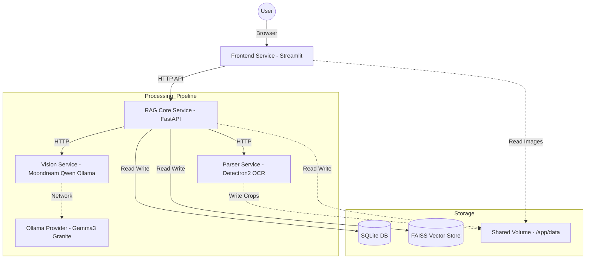

# 🧠 Smart RAG Document Analyzer (Microservices Architecture)

**An enterprise-grade, visual-first RAG system designed to understand charts, tables, and layouts in complex documents.**

Unlike traditional RAG systems that only read text, Smart RAG uses computer vision and object detection to identify, crop, and analyze visual elements (charts, slides, diagrams) using state-of-the-art Vision Language Models (VLMs) before indexing.

---

## 🏗 High-Level Architecture

The system is split into specialized microservices to ensure scalability, modularity, and hardware efficiency. All services share a data volume for access to raw files and processed images.



---

## 🧩 Microservices Breakdown

| Service | Technology | Description |
| :--- | :--- | :--- |
| **Frontend** | Streamlit | Provides the modern UI for uploading files, chatting, and browsing detected charts. |
| **RAG Core** | FastAPI, LangChain, FAISS | The "Brain". Handles orchestration, embedding generation, vector storage, and SQLite history management. |
| **Parser** | Detectron2, PyMuPDF | The "Eyes". Converts PDFs/Docs to images, runs **PubLayNet** to detect tables/figures, and performs OCR. |
| **Vision** | PyTorch, Transformers | The "Visual Cortex". Runs local VLMs (Moondream, Qwen, InternVL) to generate text descriptions of charts. |
| **Ollama** | Ollama | The "Heavy Lifter". Runs larger models (Gemma 3, Granite Vision) via API. |
| **DB Viewer** | SQLite-Web | A lightweight web interface to inspect the database at `port:8080`. |

---

## 🚀 Getting Started

### Prerequisites

*   **Docker & Docker Compose**
*   **API Keys:**
    *   **Groq API Key:** For high-speed text generation (Llama 3/4).
    *   **Sanctuary API Key:** (Optional) Alternative LLM provider.
*   **Ollama:**
    *   *Mac/Dev:* Install the [Ollama Desktop App](https://ollama.com).
    *   *Linux/Prod:* Docker handles the Ollama container automatically.

### 1. Configuration (`.env`)

Create a `.env` file in the root directory:

```ini
# API Keys
GROQ_API_KEY=your_groq_api_key_here
SANCTUARY_API_KEY=your_sanctuary_key_here

# Environment Mode
# Set to "True" for Mac/Local Dev (Uses CPU/MPS and Local Ollama)
# Set to "False" for Linux/Prod (Uses NVIDIA T4 GPU and Containerized Ollama)
TEST=True
```

### 2. Running Locally (Mac M-Series / Dev)

In this mode, the system runs lightweight services in Docker and offloads heavy AI inference to your Mac's native NPU/GPU via the Ollama app.

1.  **Configure Local Ollama:**
    Docker needs permission to access your Mac's Ollama. Run this in your terminal:
    ```bash
    launchctl setenv OLLAMA_HOST "0.0.0.0"
    ```
    *Restart the Ollama app after running this.*

2.  **Pull Vision Models:**
    ```bash
    ollama pull gemma3
    ollama pull granite3.2-vision
    ```

3.  **Start the System:**
    ```bash
    docker compose up --build
    ```

4.  **Access the App:** Open **http://localhost:8501**

### 3. Running in Production (Linux + NVIDIA GPU)

In this mode, Docker manages everything, including the Ollama instance, and maps the NVIDIA GPU to the containers.

1.  **Set Environment:**
    Change `TEST=False` in your `.env` file.

2.  **Start with GPU Overrides:**
    ```bash
    docker compose -f docker-compose.yml -f docker-compose.prod.yml up --build -d
    ```

---

## 🛠 Features

### 1. Multi-Document Processing
Upload multiple PDFs, PowerPoints, or Word Docs at once. The system creates a "Session" grouping these files. You can chat with the entire context window of all documents simultaneously.

### 2. Intelligent Chart Browser
The `Parser` service identifies visual elements. The `Vision` service describes them.
*   Go to the sidebar to see the **Chart Browser**.
*   Navigate through every chart found in your documents.
*   Read the AI-generated analysis of the data trends within the chart.

### 3. Parent-Child Chunking
Instead of naïve text splitting, we use a **Parent-Child** strategy:
*   **Child Chunks:** Small text fragments used for precise vector search match.
*   **Parent Chunks:** Larger context blocks returned to the LLM to ensure the answer has full context.

### 4. Database Persistence
All chat history, processed document metadata, and chart descriptions are stored in a persistent SQLite database (`data/history.db`).
*   To view the DB: Open **http://localhost:8080**

---

## 📂 Project Structure

```text
.
├── docker-compose.yml          # Base config (CPU/Mac compatible)
├── docker-compose.prod.yml     # Production overrides (GPU support)
├── .env                        # Secrets and Config
├── data/                       # Mapped volume (Uploads, DB, Vector Index)
│   ├── uploads/
│   ├── faiss_indexes/
│   └── history.db
└── services/
    ├── frontend/               # Streamlit UI
    │   ├── src/                # UI Logic & API Client
    │   └── Dockerfile
    ├── rag_core/               # Orchestrator & Logic
    │   ├── src/core/           # Pipeline, Chunking, Persistence
    │   └── Dockerfile
    ├── parser/                 # Document Parsing
    │   ├── src/utils/          # PubLayNet / Detectron2 Logic
    │   └── Dockerfile
    └── vision/                 # Vision Models
        ├── src/vision/         # Model definitions
        └── Dockerfile
```

---

## 🔧 Troubleshooting

**"Ollama connection failed"**
*   *Mac:* Ensure you ran `launchctl setenv OLLAMA_HOST "0.0.0.0"` and restarted the Ollama app. Ensure `TEST=True` in `.env`.
*   *Linux:* Ensure the `ollama` container is running and healthy.

**"Exec format error" or "Platform mismatch"**
*   This happens if you try to run an x86 image on ARM64 or vice versa. The Dockerfiles use `python:3.10-slim` which supports both architectures automatically. Rebuild with `docker compose build --no-cache`.

**Database Permission Denied**
*   If `db_viewer` fails, ensure the `data/` folder on your host machine has read/write permissions for the Docker user.